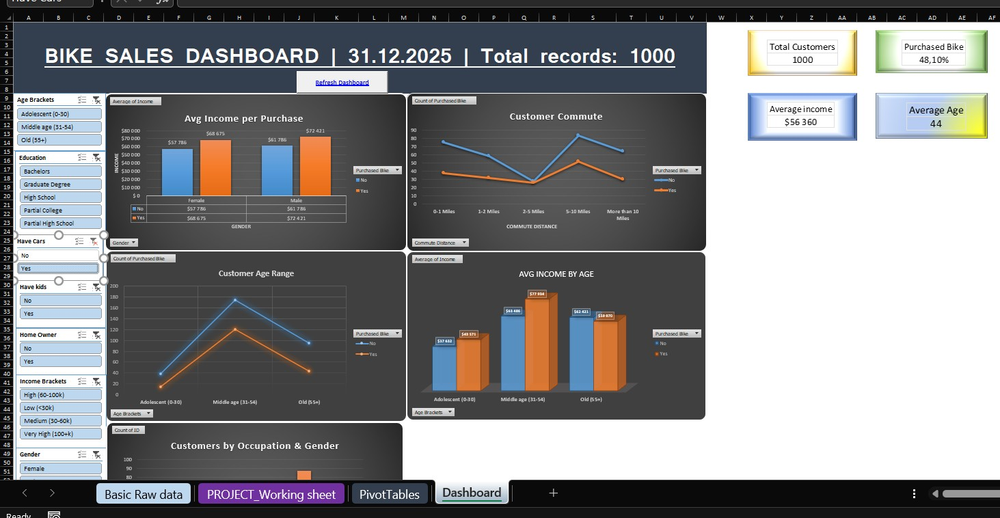

# Project Excel: Bike Buyers Dashboard - Purchasing behavior analysis

Interactive dashboard in Excel analyzing reasons that impact decision of buying a bike.
Dataset with 1000 records of customers with demographical data, income and occupation.

Project is based on "Alex the Analyst Tutorial", but expended on my own changes and elements to show my knowledge and abilities.

## What was done:
- Preparation of data.
- Cleaning the data.
- **Added columns**:
  = Income Bracket (IFS)
  = Have Kids (IF base on kids amount)
  = Commute Order
  = Average and Max/Min columns.
- **KPI Cards**:
  = Total Customers
  = Bike purchase rate (% bought a bike)
  = Average Income
  = Average Age
- **Interactive dashboards**:
  = Average Income by Age Bracket & Purchased Bike
  = Bikes purchased by Commute Distance
  = Average Income by Gender & Education
  = Customer Age Range distribution
All the Pivot tables connected via **Data Model**, thanks to what all the selected slicers work simultaneously on all of the dashboards.
**Macro VBA** refreshing all the tables with one click on a button.

# Files
[Bike_Buyers_Dashboard](02_Bike_Buyers_Dashboard/Bike_Buyers_Dashboard.xlsm) - main file with all the analysis done.

