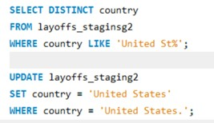
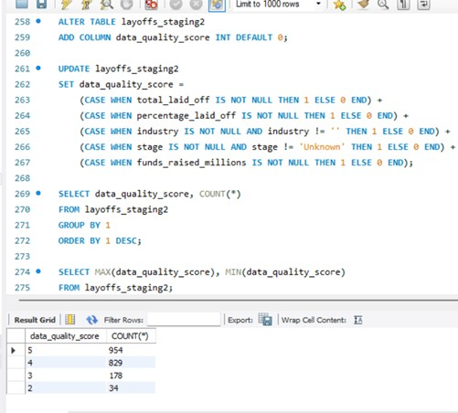
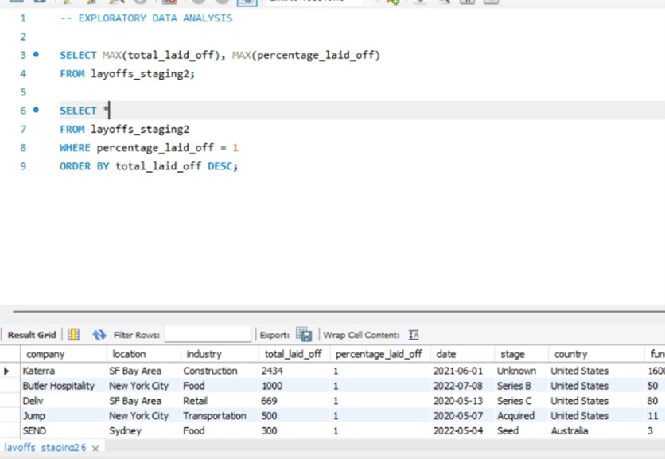
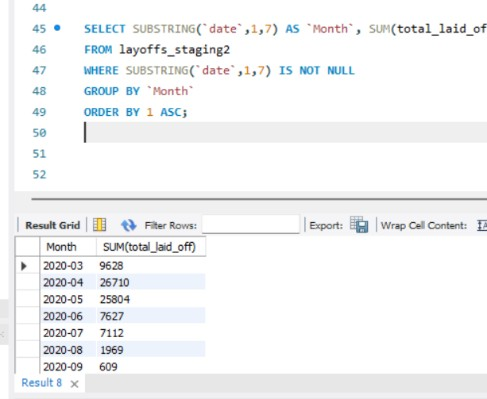
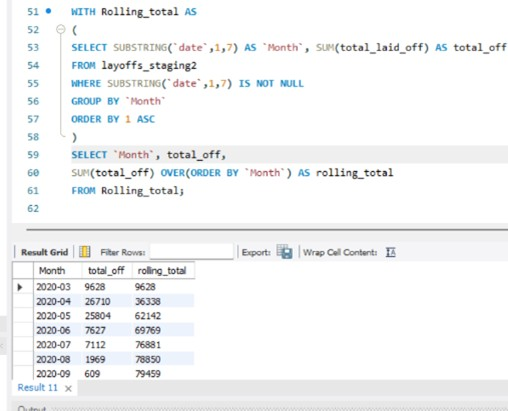
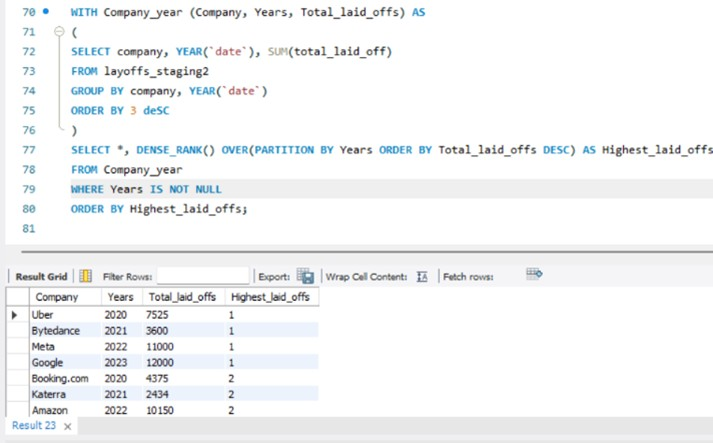
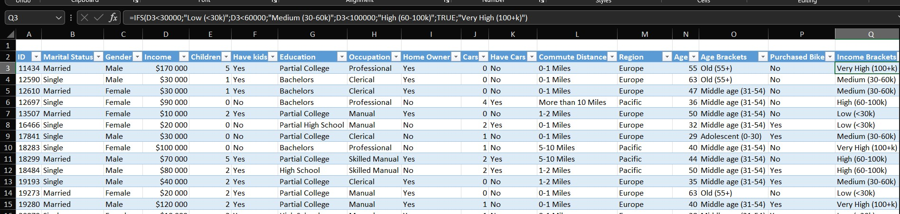
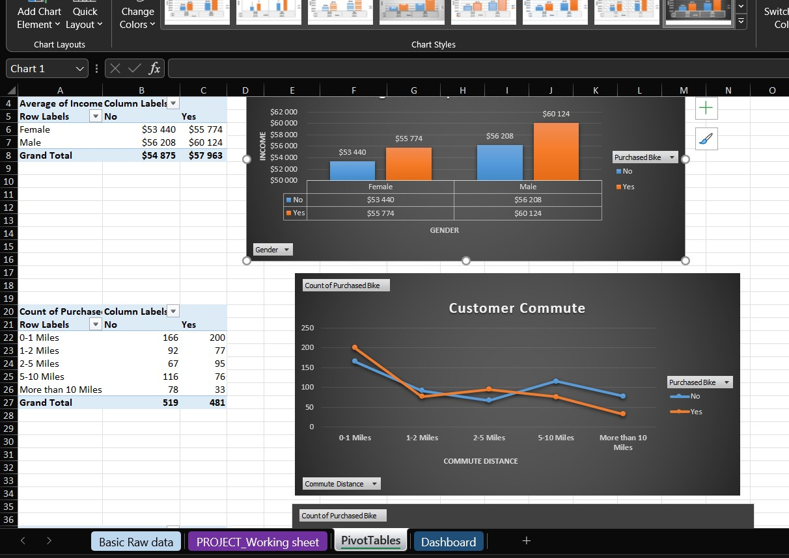

# Data Analycis Portfolio

Hi! I'm Pavlo, a data enthusiast passionate about turning raw data into meaningful insights.  
I enjoy working with SQL, Excel, Tableau, Python, Power BI and other tools to solve real-world problems (for instance SAP & Salesforce).

Here are some of my completed projects (more coming soon!):

## Projects

### 1. Data Cleaning - Global Layoffs 2020-2023 (MySQL)
Cleaned a dataset of tech industry layoffs during and post-COVID era.
Removed duplicates, standardized text values, handled NULLs and blanks, converted data types, created own system of measuring the quality of data + summarizing report.

[Detailed description and code](01_Layoffs_Data_Cleaning_and_Analysing/Layoffs_Cleaning_Project.sql)

### 2. Exploratory Data Analysis Project - Layoffs 2022 (above related; My SQL)
Deep dive into trends using advanced SQL:  
- Total/percentage layoffs by company, industry, country, funding stage, and time  
- Monthly trends with rolling (cumulative) totals using window functions  
- Yearly top 5 companies by layoffs using CTEs and DENSE_RANK()

[Detailed description and code](01_Layoffs_Data_Cleaning_and_Analysing/Layoffs_Exploratory_Data_Analysis_Project.sql)

### 3. Bike Buyers Dashboard (Excel)
Built a fully interactive dashboard analyzing customer behavior and factors influencing bike purchases (1,000 records)
Core features: pivot tables, pivot charts, slicers, dynamic layout  
- Added calculated columns using advanced formulas – e.g., Income Brackets, "Has Kids", ordered Commute Distance  
- KPI cards at the top (Total Customers, Purchase Rate %, Avg. Income, Avg. Age)  
- All pivots connected via Data Model for full cross-filtering  
- VBA macro with refresh button to update all pivots instantly

## Work in progress with...:
- Tableau
- Python
- Power BI

## Contact 
Linkedin: https://www.linkedin.com/in/pavlo-den
Email: pashadenysyuk0@gmail.com

Feel free to explore the projects on GitHub (links in the repository) or download the files to see them in action.  
I'm always open to feedback and new opportunities!

Thanks for visiting and have a great day!  
Pavlo
