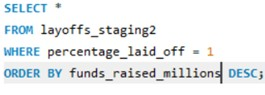
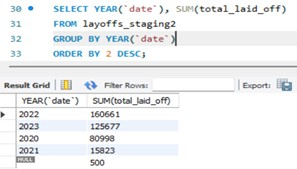

# Data Analycis Portfolio

Hi! Here is Pavlo, I really like to work with data.
Here you can find some of my projects done in SQL, Excel, Tableau, Python, Power BI and others.

## Projects

### 1. Data Cleaning - Layoffs 2022 (MySQL)
Cleaning database of laid offs in tech companies in the few recent years - mostly COVID time affected.
Removing duplicates, standardizing, filling up NULLs fields, own system of measuring the quality of data + summarizing report.

[Detailed description and code](01_Layoffs_Data_Cleaning_and_Analysing/Layoffs_Cleaning_Project.sql)

### 2. Exploratory Data Analysis Project - Layoffs 2022 (above related; My SQL)
Deeper and wider investigation and anylysis of the data related to layoffs in big technology companies.
Working with more filters, substring and CTE's.

[Detailed description and code](01_Layoffs_Data_Cleaning_and_Analysing/Layoffs_Exploratory_Data_Analysis_Project.sql)

### 3. Bike Buyers Dashboard (Excel)
Interactive dashboard with an analyze of customers behavior who buy bikes.
Advanced formulas, Pivto tables, slicers, own columns + macro VBA for a refreshing.

## Work in progress with...:
- Tableau
- Python
- Power BI

## Contact 
Linkedin: https://www.linkedin.com/in/pavlo-den
Email: pashadenysyuk0@gmail.com

Thank you for visiting!

