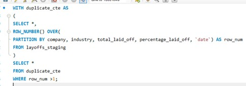
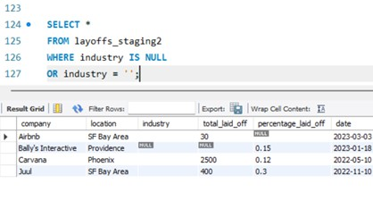
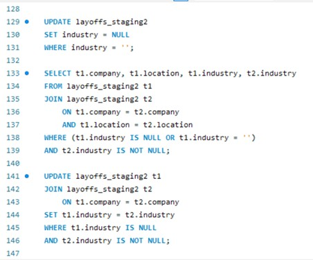
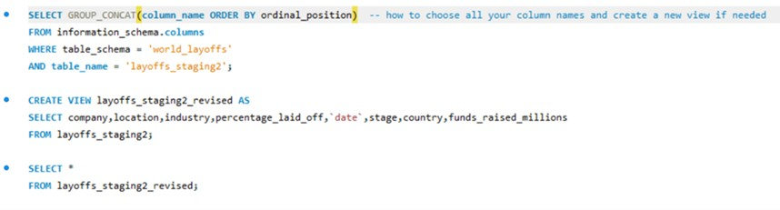
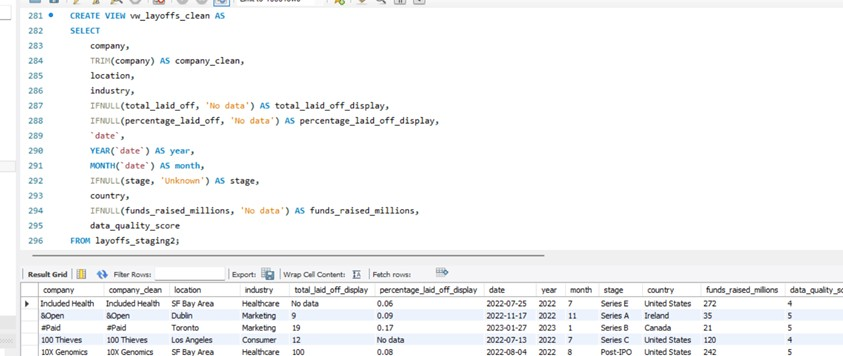

# Data Analycis Portfolio

Hi! Here is Pavlo, I really like to work with data.
Here you can find some of my projects done in SQL, Excel, Tableau, Python, Power BI and others.

## Projects

### 1. Data Cleaning - Layoffs 2022 (MySQL)
Cleaning database of laid offs in technology companies among the few recent years - mostly COVID time affected.
Removing duplicates, standardizing, filling up NULLs fields, own system of measuring the quality of data + summarizing report.

[Detailed description and code](./Layoffs_Cleaning_Project/)

### Exploratory Data Analysis Project - Layoffs 2022 (above related; My SQL)
Deeper and wider investigation and anylysis of the data related to layoffs in big technology companies.
Working with more filters, substring and CTE's.

