# Data Analycis Portfolio

Hi! I'm Pavlo, a data enthusiast passionate about turning raw data into meaningful insights.  
I enjoy working with SQL, Excel, Tableau, Python, Power BI and other tools to solve real-world problems (for instance SAP & Salesforce).

Here are some of my completed projects (more coming soon!):

## Projects

### 1. Data Cleaning - Global Layoffs 2020-2023 (MySQL)
Cleaned a dataset of tech industry layoffs during and post-COVID era.
Removed duplicates, standardized text values, handled NULLs and blanks, converted data types, created own system of measuring the quality of data + summarizing report.

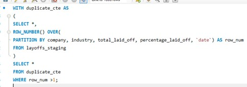
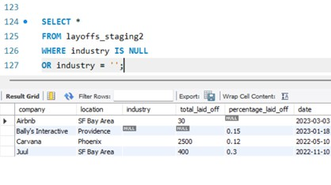
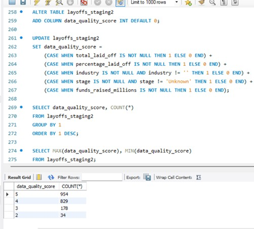

[Detailed description and code](01_Layoffs_Data_Cleaning_and_Analysing/Layoffs_Cleaning_Project.sql)

### 2. Exploratory Data Analysis Project - Layoffs 2022 (above related; My SQL)

**Deep dive into trends using advanced SQL**:  
- Total/percentage layoffs by company, industry, country, funding stage, and time  
- Monthly trends with rolling (cumulative) totals using window functions  
- Yearly top 5 companies by layoffs using CTEs and DENSE_RANK()

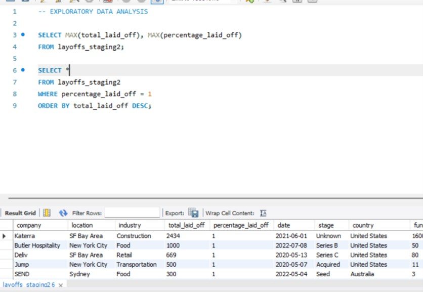
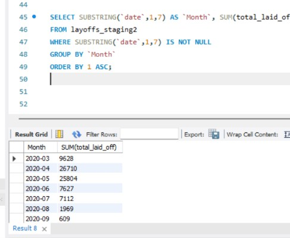
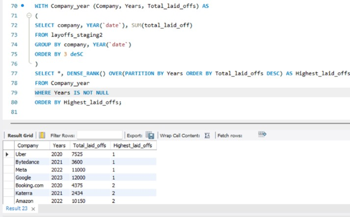

[Detailed description and code](01_Layoffs_Data_Cleaning_and_Analysing/Layoffs_Exploratory_Data_Analysis_Project.sql)

### 3. Bike Buyers Dashboard (Excel)
Built a fully interactive dashboard analyzing customer behavior and factors influencing bike purchases (1,000 records).

**Core features**: 
- Pivot tables, pivot charts, slicers, dynamic layout  
- Added calculated columns using advanced formulas – e.g., Income Brackets, "Has Kids", ordered Commute Distance  
- KPI cards at the top (Total Customers, Purchase Rate %, Avg. Income, Avg. Age)  
- All pivots connected via Data Model for full cross-filtering  
- VBA macro with refresh button to update all pivots instantly

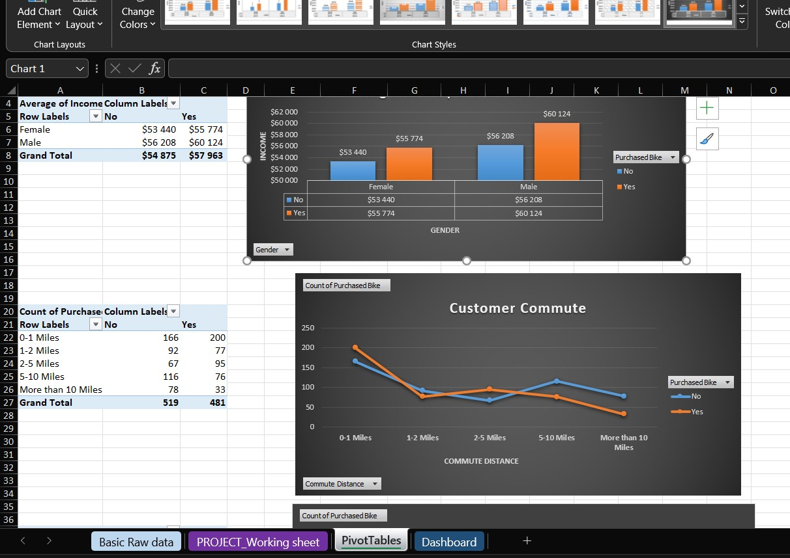
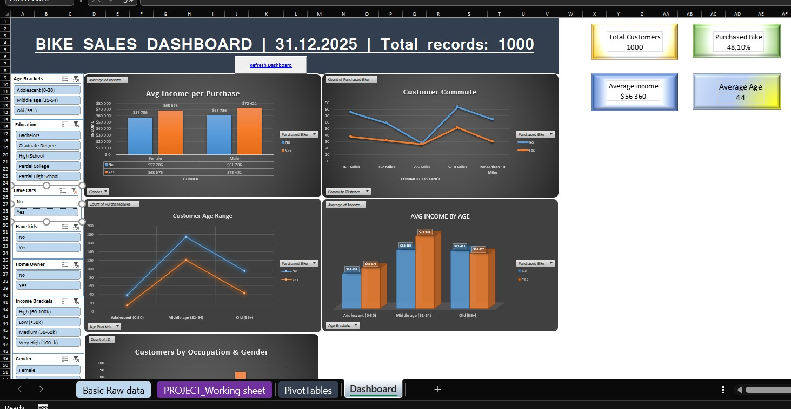

[Description](02_Bike_Buyers_Dashboard/README.md)
[File_download](02_Bike_Buyers_Dashboard/Bike_Buyers_Dashboard.xlsm)

### 4. Seattle Airbnb Market Analysis Dashboard (Tableau)
An interactive Tableau dashboard exploring the Seattle short-term rental market using Airbnb listings data (2016–2025). Visualizes key trends in average prices, availability/occupancy, property types, and neighborhood performance.

**Key Insights**:
- Average prices show long-term fluctuations with a post-pandemic peak (~2021) followed by gradual cooling through 2025, reflecting real-world market dynamics like tech growth and higher interest rates.
- Premium neighborhoods/ZIP codes command significantly higher rates.
- Entire homes/apartments dominate higher-price segments, while private rooms offer more affordable options.
- Availability trends indicate seasonal occupancy patterns and overall market saturation over time.
- Listing density and review activity highlight the most popular/active areas for hosts and guests.

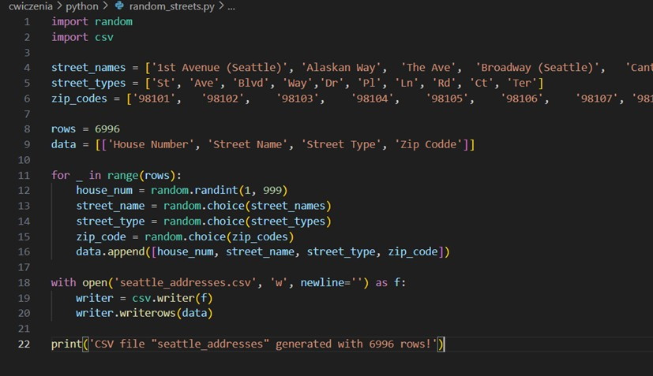
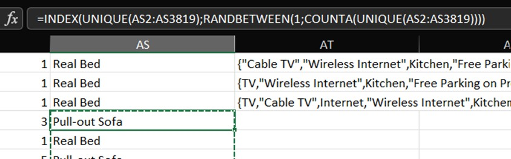
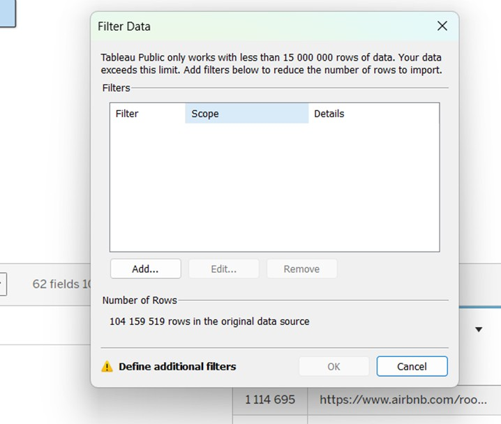
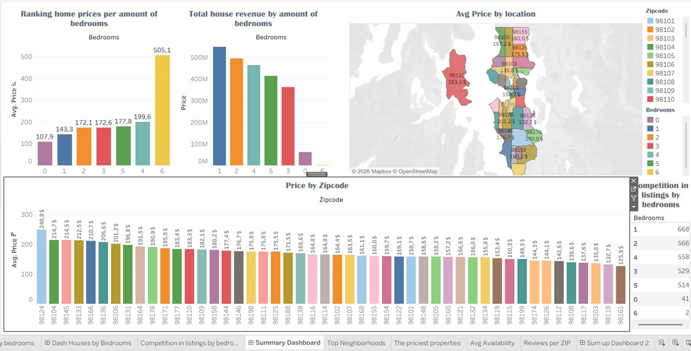

[View_Dashboard1_on_Tableau_Public](https://public.tableau.com/views/Listings_Airbnb_Tableau_Project_Addons/SummaryDashboard?:language=en-US&:sid=&:redirect=auth&:display_count=n&:origin=viz_share_link)
[View_Dashboard2_on_Tableau_Public](https://public.tableau.com/views/Listings_Airbnb_Tableau_Project/SumupDashboard2?:language=en-US&:sid=&:redirect=auth&:display_count=n&:origin=viz_share_link)

### 5. Professional Survey Analytics Dashboard (Power BI)
In this project I created interactive dashboard that visualizes the real-world data received from hundreds respondents of one of global professional surveys. It is mainly showing global relation of people's job positions, industries, their average salaries and their satisfaction with different aspect of life. 

**Key Insights**:
- The dataset was cleaned and transformed entirely within Power BI using Power Query (no external tools like Excel or Python).
- The goal was to transform raw, messy survey responses into meaningful insights about job titles, salaries, programming languages, job satisfaction, age demographics, and geographic distribution.
- Transformed raw current age into interpretable buckets using chained IF-ELSE logic:
    = Youth (≤20)
    = Young Adulthood (20–44)
    = Middle Adulthood (45–64)
    = Elderly (65+)
- 630 respondents worldwide, with an average age of 29.87 — data field is young and global.
- Data Scientists have the highest average salary, followed by Data Engineers and Data Analysts.
- Gender split: Nearly even (55.1% male, 44.9% female).

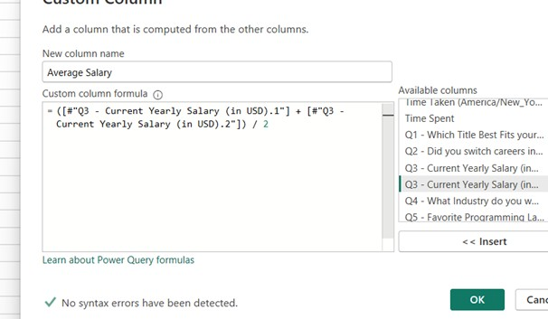
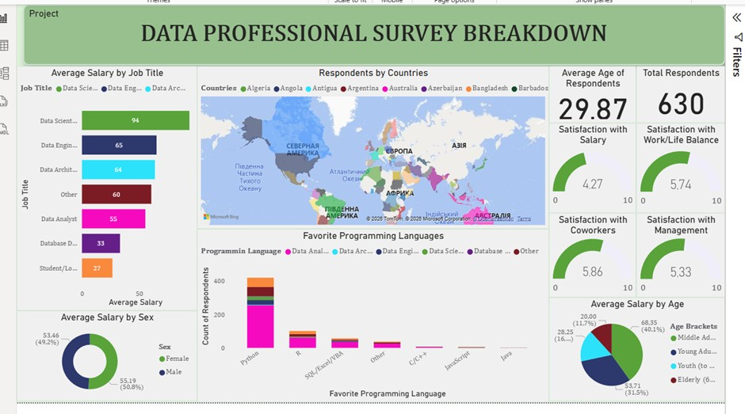

## Work in progress with...:
- Python

## Contact 
Linkedin: https://www.linkedin.com/in/pavlo-den
Email: pashadenysyuk0@gmail.com

Feel free to explore the projects on GitHub (links in the repository) or download the files to see them in action.  
I'm always open to feedback and new opportunities!

Thanks for visiting and have a great day!  
Pavlo
